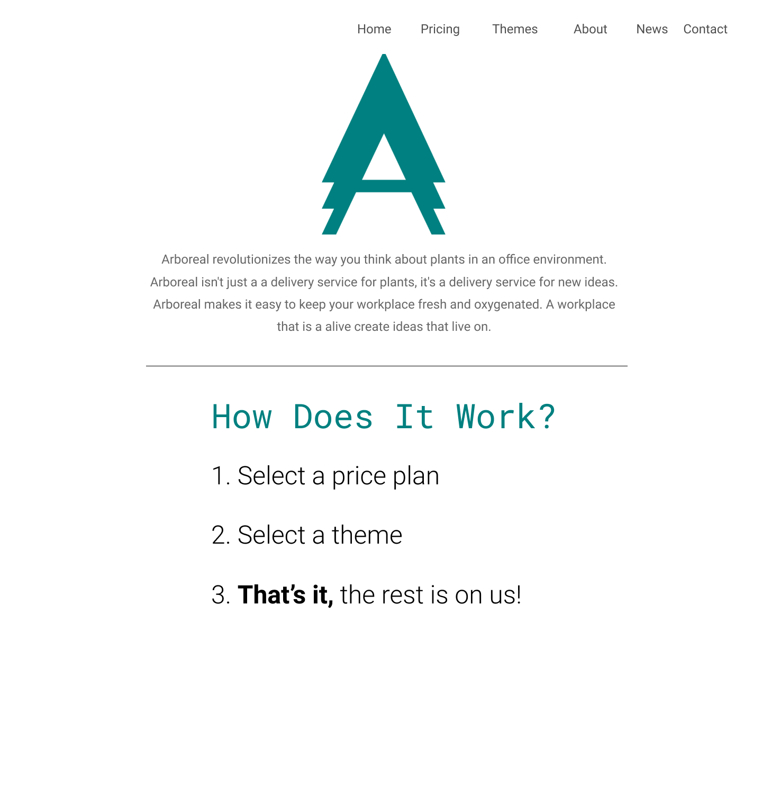
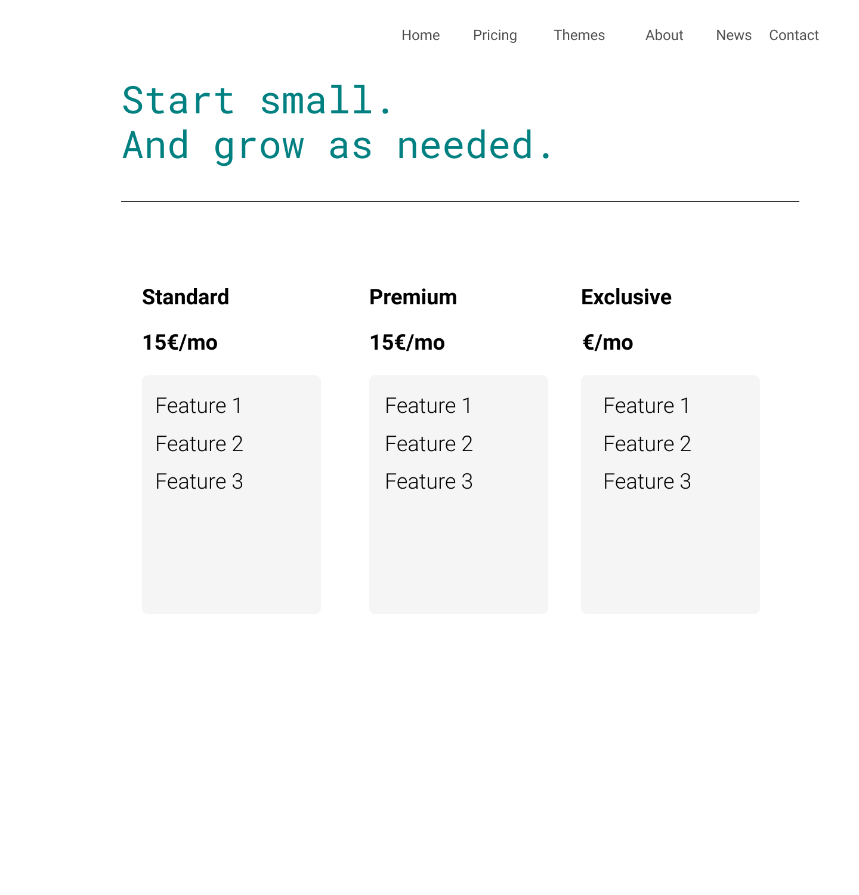
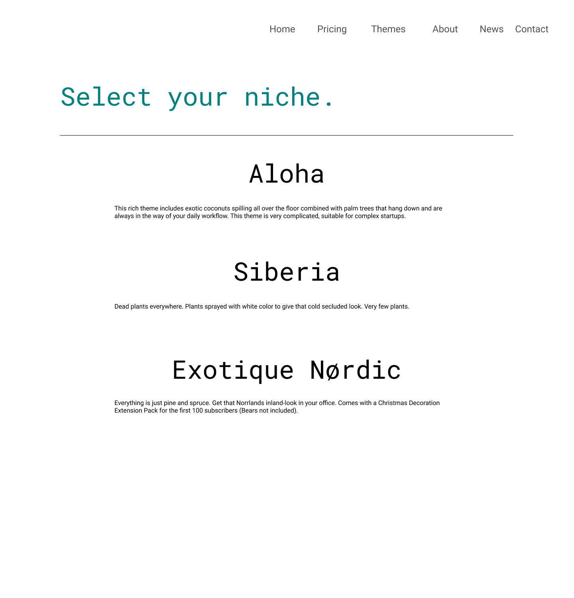
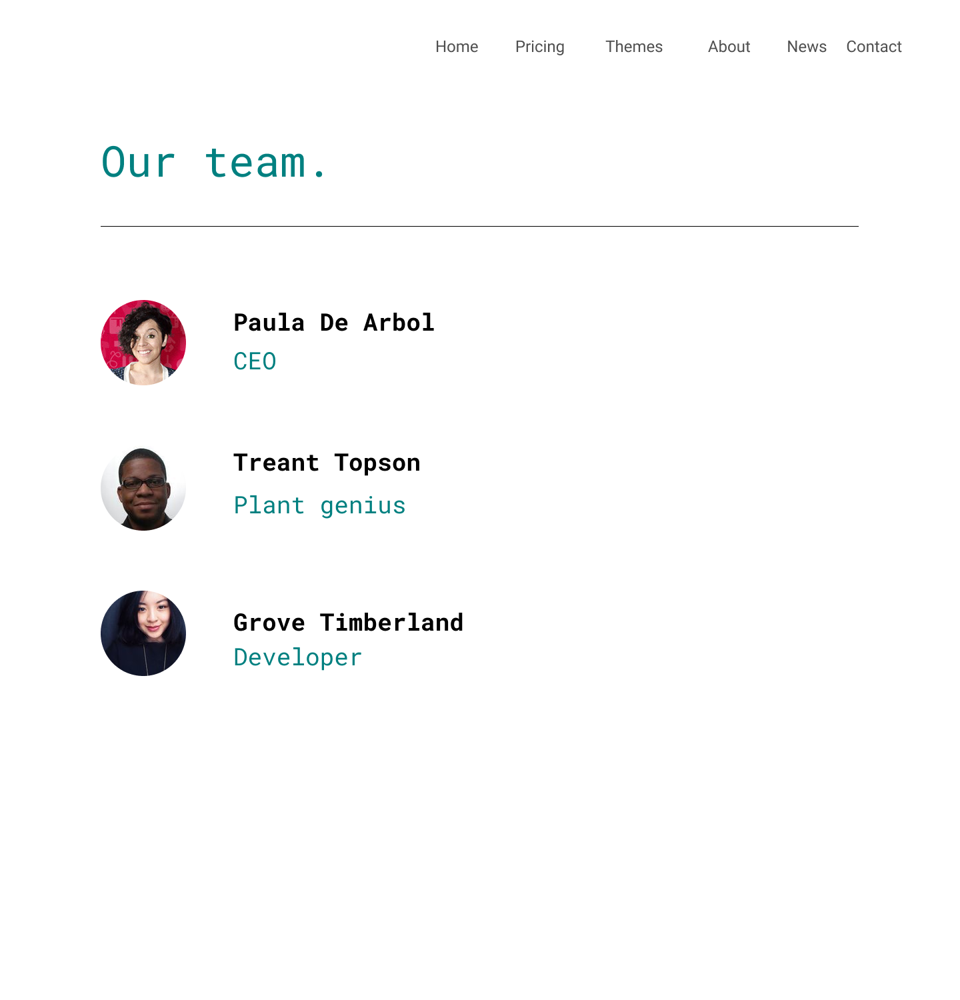
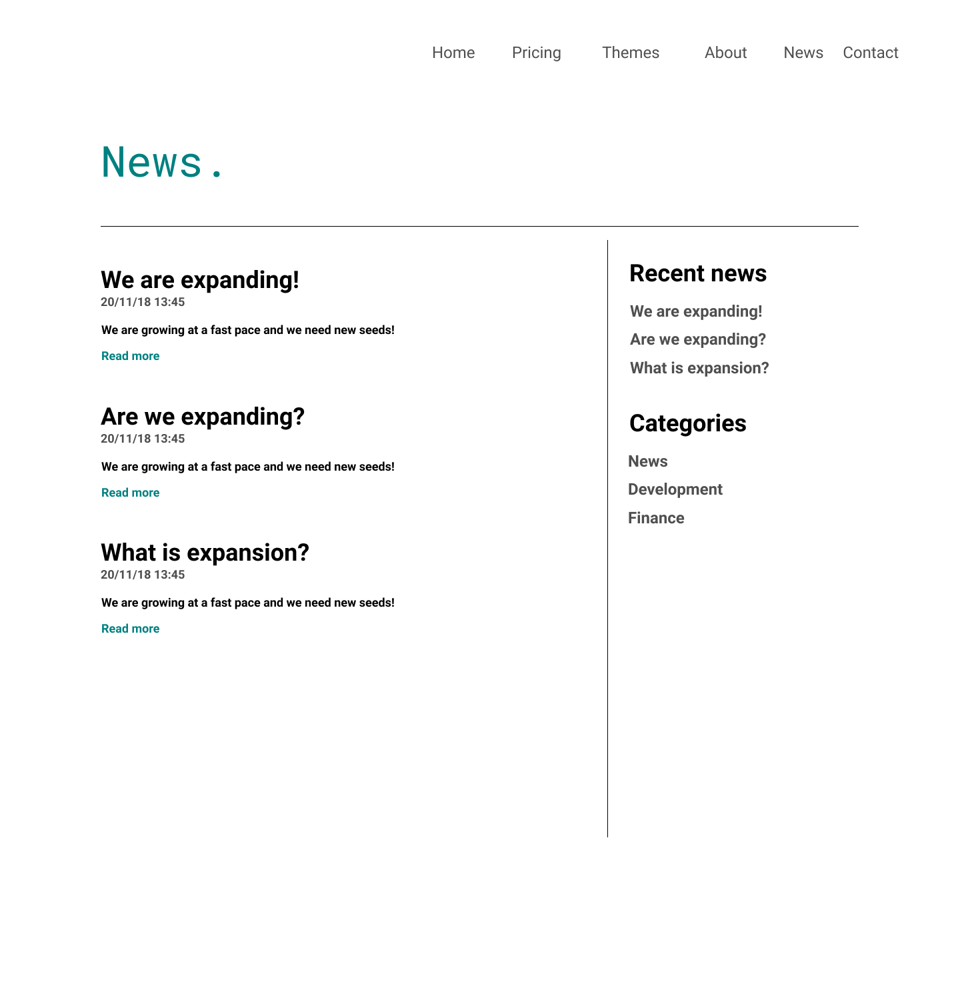
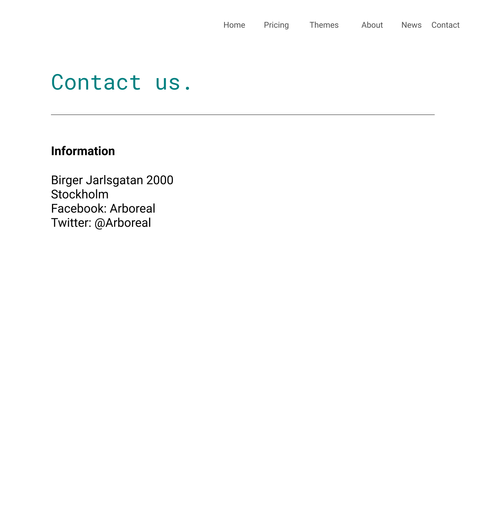

# Inlämningsuppgift 3 - CMS

> Individuell
>
> **Betygsnivå**: IG/G/VG

## Mål

Målet med uppgiften är att utvärdera dina kunskaper i följande moment:
* CMS -> WordPress
* Modifiering av CMS
* Skapande av egna teman i WordPress
* Skapande av egna mallar i WordPress

## Uppgiftsbeskrivning

Startup-företaget **Arboreal** behöver en ny sida för sin affärsidé. Du får uppdraget att skapa denna sida. De har redan en grov mockup på hur de ungefär vill att sidan ska se ut. De har dock gett dig lite friare tyglar gällande designen och du får göra vissa förändringar utifrån det du tycker att sidan behöver.

Eftersom du vill göra det enkelt för kunden att uppdatera sidan i efterhand utifall de vill lägga till mer information så har du bestämt dig för att bygga sidan i **CMSet WordPress**. På detta sätt behöver du inte kontaktas varje gång en liten ändring på sidan ska ske.

Företaget har skickat med den informationen som ska läggas in på sidan samt några enklare mockups i form av `.png`-filer. Informationen som ska vara med på sidan finns under [**Detaljer**](#detaljer)

## Krav

* Sidan följer övergripande de mockups som är bifogade till uppgiften. Dessa behöver inte strikt följas utan viss ändring på layouten får ske. Huvudsaken är att innehållet ska finnas och att detta innehåll ska kunna administreras och ändras via admin-gränssnittet. Innehållet ska alltså inte vara hårdkodat i kod utan all information ska vara inlagd via **Pages** eller **Posts** så att kunden senare kan ändra denna information i efterhand.
* Ändringar i layouten ska främst ske via ändring i den egna css-filen eller via att skapa nya templates.
* Förstasidan ska vara en [**Static Frontpage**](https://codex.wordpress.org/Creating_a_Static_Front_Page) som är en unik förstasida som skiljer sig från resten av sidorna.
* Det ska även finnas en **News**-sida som visar upp samtliga **Posts**
* Sidan använder sig utav ett [**Child Theme**](https://developer.wordpress.org/themes/advanced-topics/child-themes/) till det inbyggda temat **Twenty Sixteen**. Du får även använda ett **blankt tema** om du vill och upplever att det blir lättare. Inga ändringar ska ske på det ursprungliga temat utan alla ändringar i CSS & PHP ska ske på ditt egna **Child Theme**.
* Sidan använder sig utav en eller flera [**Custom Templates**](https://developer.wordpress.org/themes/template-files-section/page-template-files/). Ska en modifiering av en speciell sida ske så ska du skapa en ny template för denna sida i ditt _Child Theme_.
* Extra plugins får installeras för att lösa uppgiften. 

## Bedömning

* För G krävs att du har uppfyllt kraven ovan och att du har lämnat in en fungerande och användbar sida.
* För VG krävs det att du visar på en djupare föreståelse för modifiering av WordPress och på egen hand implementerar och utvärderar på vilket sätt temat bäst modifieras. Ett exempel på modifiering där det är en skillnad på G-nivå och VG-nivå för uppgiften: om du t.ex. ska visa upp ett antal inlägg från en specifik kategori så finns det ett flertal sätt att göra detta. En G-lösning på detta vore att installera ett plugin som gör detta åt en genom att kryssa i en checkbox. En VG-lösning vore att göra en ny Custom Template och skriva en egenskriven WordPress-query med `WP_Query`/`get_posts` som hämtar den specifika kategorin.

## Inlämning

Din sida lämnas in genom att exportera sidan med verktyget [**All-in-one WP Migration**](https://wordpress.org/plugins/all-in-one-wp-migration/)

När du har installerat detta plugin så kommer du få upp en menyrad i admin-menyn som heter exakt som pluginet heter. En undermeny till detta plugin kommer att heta **Export**.

Under denna meny finns en dropdown-meny där du kan välja **Export to file**. Tryck på **Export to file** och då borde du få upp en popup som säger **Download localhost**. Tryck på denna så ska du ladda ned den fil som ska ska lämna in. Kom ihåg att döpa om denna fil.

* **Inlämningsformat**: `.wpress` (alla andra format resulterar i försenad inlämning och komplettering)
* **Namnformat för inlämning:** `fornamn_efternamn_cms.wpress`
* **Inlämningen sker endast via inlämningsyta på zenit**
* **Tid för inlämning:** fredag 16/11 23.55_

# Detaljer

## Information om företaget

_Arboreal_ har en prenumerationstjänst för företag. Tjänsten innebär att man får sitt företags kontor inrett med växter med hjälp av experter från _Arboreal_. Sedan betalar man en månadskostnad för att få nya växter levererade och placerade på kontoret varje månad eller vecka beroende på vilken prisplan man har valt.

## Arboreals mission statement

>Arboreal revolutionizes the way you think about plants in an office environment. Arboreal isn't just a a delivery service for plants, it's a delivery service for new ideas. Arboreal makes it easy to keep your workplace fresh and oxygenated. A workplace that is a alive create ideas that live on.

## Logo

SVG: [logo.svg](assets/logo_black.svg)

## Pages

### Pricing

| Standard  | Premium | Exclusive |
|---|---|---|
| Watering not included | Watering included | Web-controlled watering system included |
| No change of dead plants, monthly plant change| Exchange of dead plants included, monthly plant change | Change of dead plants included, weekly plant exchange |
| | | Surveillence system for every plant. 24/7 support |
| | | Only locally grown plants |

### Themes

* __Aloha__
    + This rich theme includes exotic coconuts spilling all over the floor combined with palm trees that hang down and are always in the way of your daily workflow. This theme is very complicated, suitable for complex startups.
* __Siberia__
    + Dead plants everywhere. Plants sprayed with white color to give that cold secluded look. Very few plants.
* __Exotique Nørdic__ 
    + Everything is just pine and spruce. Get that Norrlands inland-look in your office. Comes with a _Christmas Decoration Extension Pack_ for the first 100 subscribers (Bears not included).

### About

* Paula De Arbol
    * CEO
* Treant Topson
    * Plant genius
* Grove Timberland
    * Developer

### Contact

* Birger Jarlsgatan 2000
* Stockholm
* Tel: 08-13371337
* Facebook: Arboreal
* Twitter: @Arboreal

## Mockups

### Frontpage

### Pricing

### Themes

### About

### News

### Contact

