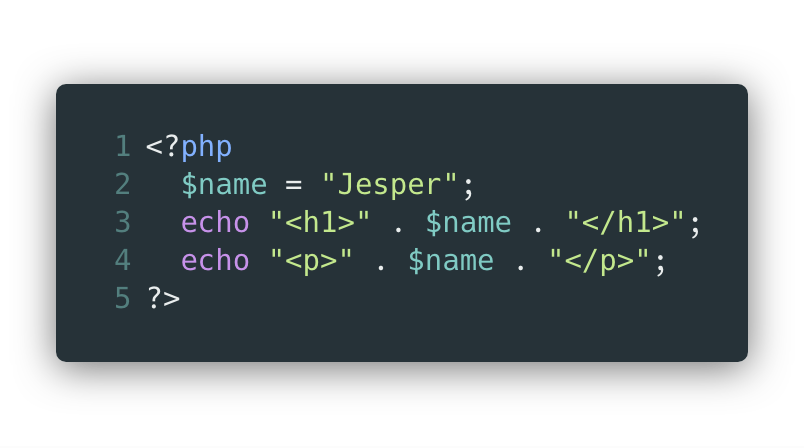

# Dynamisk Webbutveckling

---

Allting på internet är **tillgångar**

* bilder
* videos
* _HTML_
* _CSS_

Statiska tillgångar

---

PHP är dynamiskt

Ett backendspråk

Måste utvärderas och köras vi en server

---

Vad som ska utvärdereras och hur det ska utvärderas är koden vi själva skriver

# ===

# Programmering

---

## PHP konverteras alltid till HTML

## Webbläsaren kan inte läsa PHP

---

## Innehåll
* Programmera i PHP
* Autentisering & användarhantering
* Databashantering, spara information om användaren
* Best practice och säkerhet

---

## Generellt upplägg

* Liten genomgång
* Eget arbete
* Lösningsförslag
* Repeat

---

## Grundförutsättningar

* Skitmycket eget ansvar
* Jag är inget högre väsen som alla svar, hjälp varandra
* Programmeringens grund ligger i att misslyckas och att göra fel

---

Allt kretsar kring variabler: värden som varierar

[.background-color: #FFFFFF]

---

# Typer

* String
  - All text och HTML
* Integer
 - Heltal: 10, 567765, -5
* Float
 - Decimaltal: 10.055, 3.14, -5.5
* Boolean
  - true/false

---

## Övningsuppgifter och instruktioner finns på Zenit