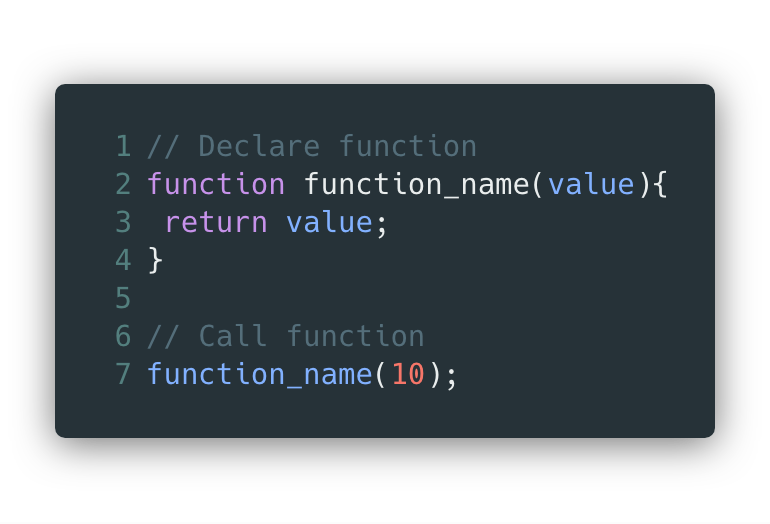
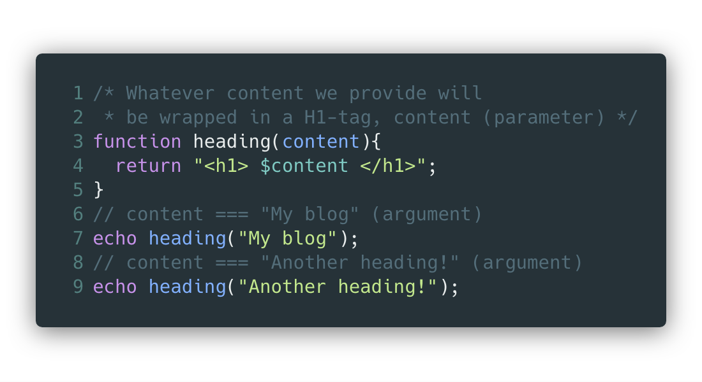

# Functions

---

* En funktion är ett block av återanvändbar kod
* En funktion är enbart en mall för vad som kommer att hända om du **kallar**(använder) funktionen

---
[.background-color: #ffffff]

---

* Värdena inom paranteserna kallas **parametrar**
* Värdena som skickas med när vi kallar på funktionen kallas **argument**
* Argument blir till parametrar

---

[.background-color: #ffffff]

---

* `echo !== return`
* `return` säger att vi ska returnera ett värde från funktionen. Vi måste sedan antingen spara värdet eller echoa ut det till användaren.
* Funktioner ska i regel `return` värden, inte `echo`

---

* Funktioner möjliggör:   **DRY** `(Don't Repeat Yourself)`
* Funktioner möjliggör:   **SRP** `(Single Responsibility Principle)`
* Funktioner möjliggör:   **KISS** `(Keep It Simple Stupid)`

---

* En funktion ska göra **en** sak och den ska göra den bra
* En funktion ska ha en uppgift `(Single Responsibility)`
* **Verkligheten** gör detta i många fall `omöjligt`

---

Övningar finns på GitHub/Zenit