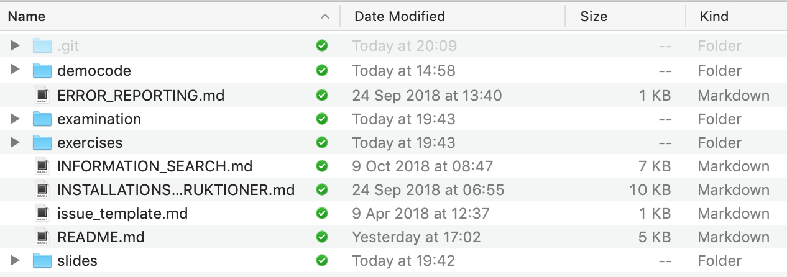
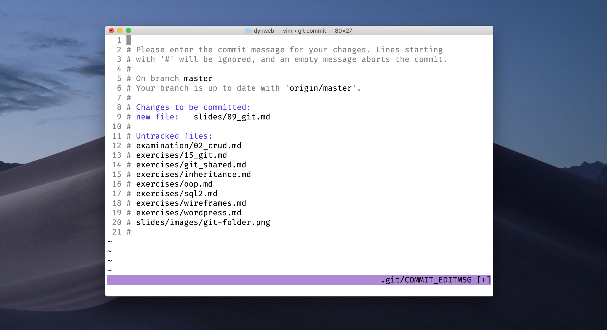
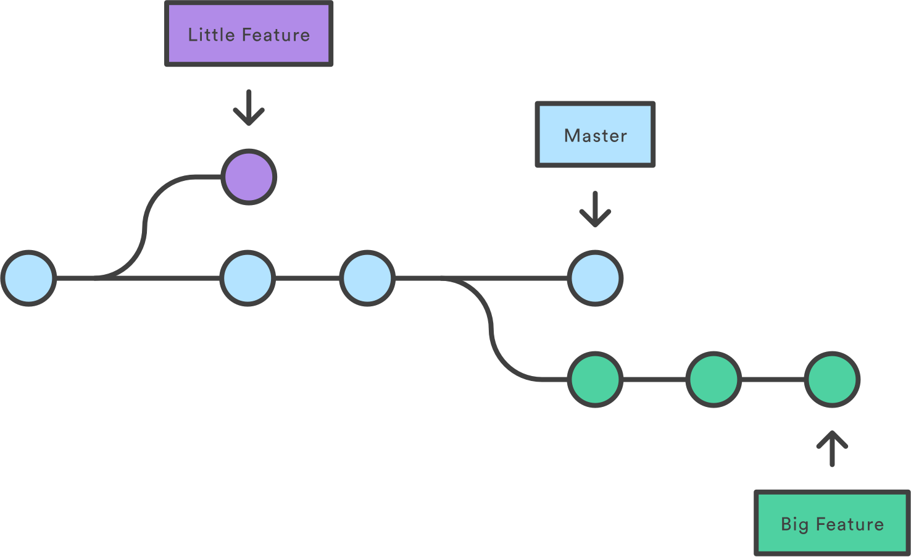

build-lists: true

# __git__

---

* Versionshanteringsystem
* Vem gjorde vad och när?
* Wikipedia, Google Docs och alla sorts kollaborativa verktyg använder det
* Förmåga att kolla på tidigare versioner (checkout) samt helt gå tillbaka till tidigare versioner (reset/revert)
* Som `CTRL + S` + `CTRL + Z` fast __ÖVERALLT__

---

* **git** är verktyget vi använder lokalt på datorn för att versionshantera
* **GitHub** är som Dropbox fast för kod, tillåter oss att dela den med andra
* Andra tjänster som använder `git`: _GitLab_ och _BitBucket_ (samma typ av tjänst)

---


---

## Två sätt att starta ett `git`-repository

* Initiera i mappen du står i:

```bash
git init
```

* Klona ett existerande (när du gör detta behövs inte `git init` köras):

```bash
git clone https://some-url-to-a-repo.com
```
---

## git bor i `.git`-mappen



* En gömd mapp som håller reda på alla dina förändringar i git. `git init` skapar denna mapp. Klonar du ett existerande repo så finns redan denna `.git`-mapp

---

## Göra en sparning (`commit`)

```bash
git add filename
```
```bash
git commit -m "Your commit message"
```

* Du väljer först vilka filer som ska vara del av sparningen med `git add`, detta kallas att **stagea** filer
* `-m` står för message, varje commit **måste** ha ett meddelande

---

## Om krisen eller **VIM** kommer

---



---

## Avsluta vim

* Tryck **ESCAPE**
* Skriv in följande: **:wq**
* Tryck sedan enter
* **:wq** står för **:writequit**, spara och avsluta

---

* **HEAD** är den senaste commiten, nyaste
* `git log` visar alla dina senaste commits
* För att komma ur `git log` kan man trycka **q** (för `quit`)
* `git status` visar om dina filer är staged eller committed

---

## Ångra commits

* Varje commit har ett unikt id som man kan ta de minst 7 första tecken på och reseta till den commiten

```bash
git reset commit-hash
```

* Man kan också säga t.ex. resetta två steg tillbaka från senaste commiten

```bash
git reset HEAD~2
```

---

* Har kvar ändringarna men tar bort commiten, utifall sparningen blev fel på något vis

```bash
git reset HEAD~1
```

* Tar bort commiten **OCH** tar bort alla ändringar 😱

```bash
git reset --hard HEAD~1
```

---

## Bara kolla lite (checkout)

* går till en viss commit, men vi får inte modifiera filerna här

```bash
git checkout commit-hash
```

* Gå tillbaka till senaste ändringarna

```
git checkout master
```

---

## **Branches**

---



---

## Vanliga typer av branches

* feature
* hotfix
* Men en branch kan heta vadsomhelst och innehålla vadsomhelst. Det är en alternativ version av din kod
* Används för att testa att implementera en viss kod innan man bestämmer sig för att använda den i den slutgiltiga produkten

---

### Branches

* `master` är den slutgiltiga produkten
* `development` brukar finnas för utveckling
* Man drar sedan in ändringarna från `development` till `master` när det är "färdigt"

---

### Problem

* Gör du en branch kl 9 på morgonen utgår branchen från hur den ursprungliga koden såg ut kl 9 på morgonen.
* Gör en kollega en ändring på den koden du gjorde en branch på t.ex. kl 14. så har du inte dessa ändringar.
* Du måste uppdatera din egen branch med de nya ändringarna och sedan fortsätta arbeta.
* Förhoppningsvis jobbar ni på två helt separata saker så det blir inga konflikter.

---

## Kommandon

* Skapa branch

```bash
git branch development
```

* Växla mellan branches

```bash
git checkout development
```

```bash
git checkout master
```