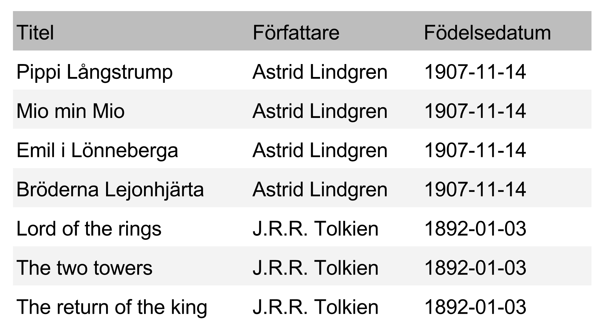
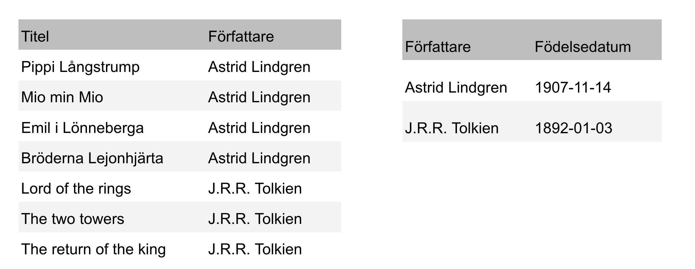
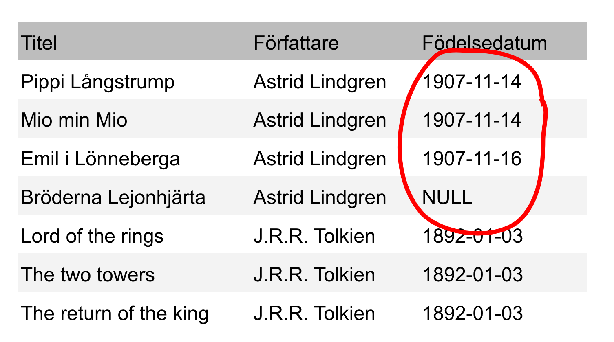
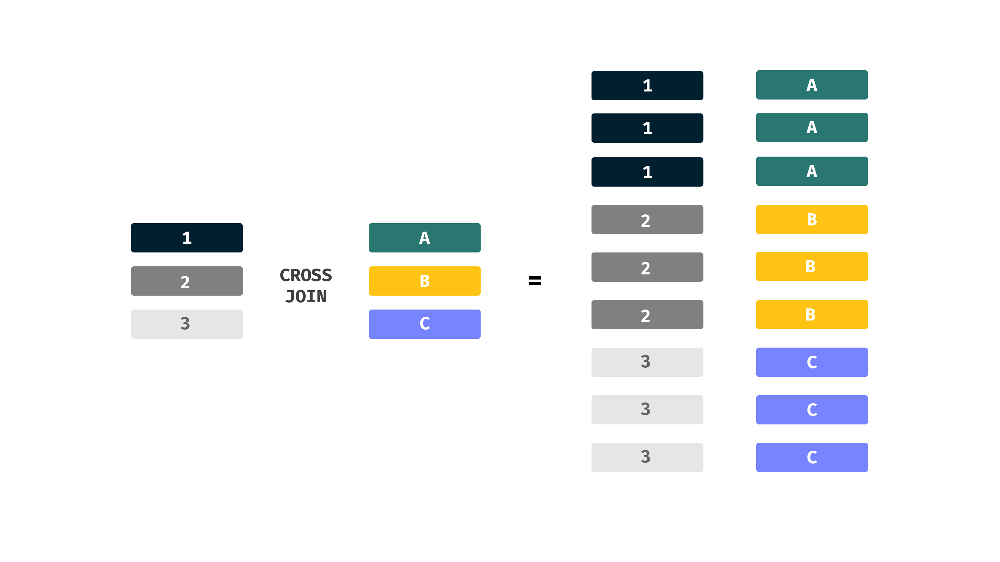
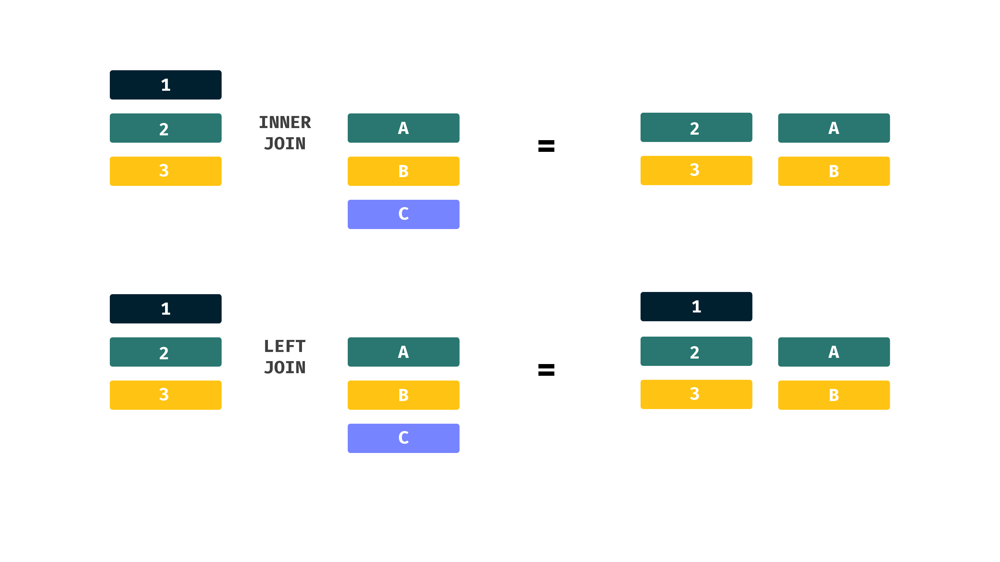
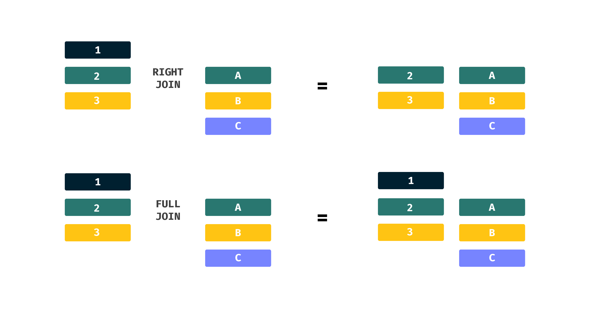

build-lists:true

# **Joins**

---

## Normalisering

* När man delar upp sina tabeller för att undvika duplicerad data, att data försvinner eller att data uppdateras olika
* Länkar olika tabeller via dess ID istället för att lägga allting i en och samma tabell

---

---

---

---

* Har vi separerat tabeller behöver vi dock lägga ihop dessa för att få all data
* Varje tabell ska ha en unik nyckel (**Primary Key**) som oftast är ett ID
* Man binder oftast samman tabellerna genom att länka deras ID mellan varandra

---

## **Joins**

---

* **CROSS**: Allting utgår från denna join
* **LEFT**: Behåller alla rader i "vänstra" tabellen
* **RIGHT**: Behåller alla rader i den "högra" tabellen

---

* Lägger ihop två tabeller i samtliga kombinationer 

---

---

---

