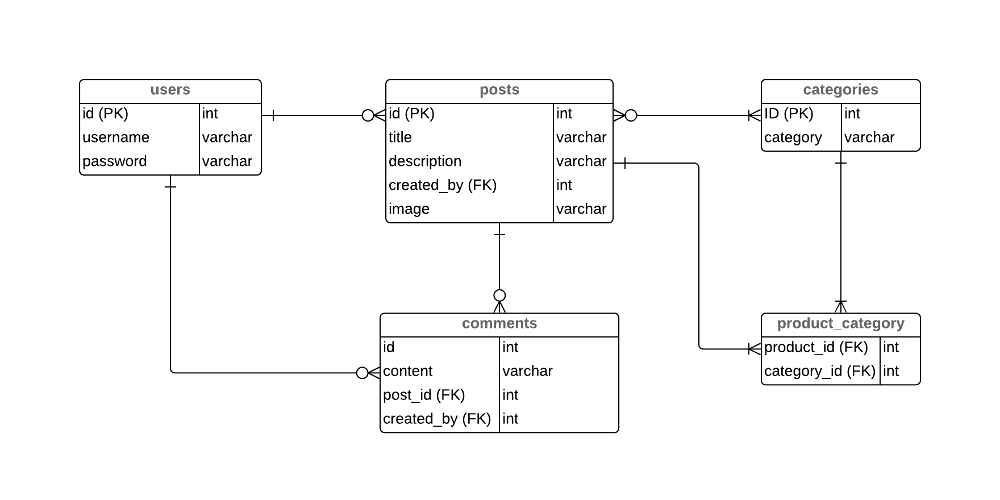

autoscale: true
build-lists: true

# **Projekt**

---

### **Kodstruktur**

---

* 📁`project-folder`
  * 📁`classes`
      * 🗒 `Auth.php`
      * 🗒 `Posts.php`
  * 📁`includes`
      * 🗒 `database-connection.php`
  * 📁`views`
      * 🗒`login-page.php`
  * 🗒`index.php`
  * 🗒 `README.md`

---

## [Exempelstruktur @ GitHub](https://github.com/fed18/project-structure-example)

---

# **Coding Standard / Style Guide**

* Mindre viktigt exakt hur ni gör
* Mer viktigt att alla gör *likadant*
* Sätt upp en fil som heter **_kodstandard.md_**/**guidelines.md** eller liknande där ni dokumenterar hur ni ska jobba

---

### Några exempel på kodstandarder/stilguider

* [_FIG-PHP_ PSR-2 Coding Style Guide](https://www.php-fig.org/psr/psr-2/)
* [_PEAR_ Coding Standards](https://pear.php.net/manual/en/standards.php)
* [_ZEND_ Coding Standards](https://framework.zend.com/manual/2.4/en/ref/coding.standard.html)
* [PHP Style Guide](https://gist.github.com/ryansechrest/8138375)

---

### Wireframes / Mockups

* Inget krav på att göra wireframes / mockups
* Det kan dock vara smart att göra en grov skiss över hemsidan så att alla är överens om hur det ska se ut

---

# **Git**

---

---

1. Separate subject from body with a blank line
2. Limit the subject line to 50 characters
3. Capitalize the subject line
4. Do not end the subject line with a period
5. Use the imperative mood in the subject line
6. Wrap the body at 72 characters
7. Use the body to explain what and why vs. how

[https://chris.beams.io/posts/git-commit/](https://chris.beams.io/posts/git-commit/)

---

* Synka er kod ofta (`push`/`pull`)
* Gör commits ofta
* Samtliga gör pull till master när någon har mergat en pull request
* Försök att undvika att jobba på samma fil samtidigt
* Jobba på samma sätt som i **storyteller**-övningen

---

# **ER Diagram**

* Metod för att visualisera databastabellers relationer
* [What is Entity Relationship Diagram (ERD)? @ Visual Paradigm](https://www.visual-paradigm.com/guide/data-modeling/what-is-entity-relationship-diagram/)

---

* >An ERD entity is a definable thing or concept within a system
* User, Comment, Category etc.
* I vårt fall varje tabell vi har i databasen

---

## Cardinality

* Relationen mellan olika entiteter
    * One-to-one
    * One-to-many
    * Many-to-many
* En Användare har flera Inlägg men ett Inlägg har bara en Användare

---

---

# Keys

* **Primary Key (PK)**
  * Den unika nyckel som identiferar en specifik rad i en tabell
  * Vi har oftast använt `id` (int)
* **Foreign Key (FK)**
  * Den unika nyckeln från en annan tabell som länkar samman tabellerna
  * `cart` hade t.ex. `product_id` samt `user_id`. Både `product_id` och `user_id` är Foreign Keys.

---

---

---

# Funderingar?
